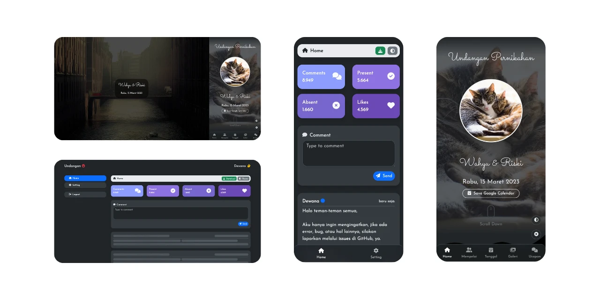

# 💌 Undangan Pernikahan Digital — Rendra Mukti & Gita Rahayu S.Ak

Website undangan pernikahan digital yang responsif dan interaktif, dengan **backend mandiri** (Node.js + Express) dan database **PostgreSQL** (Supabase). Tidak bergantung pada layanan undangan pihak ketiga.

Berbasis template open-source [dewanakl/undangan](https://github.com/dewanakl/undangan), lalu dikembangkan dengan backend sendiri, guest manager, dan QR check-in.



---

## ✨ Fitur Utama

- 🎨 **Tampilan elegan & responsif** — mobile-first, animasi halus (AOS, confetti).
- 💬 **Buku tamu & ucapan** — kirim ucapan, konfirmasi kehadiran (RSVP), like, dan reply.
- 🛡️ **Dashboard admin** (`/dashboard.html`) — pengaturan undangan, moderasi ucapan, ganti password, regenerasi access key, filter kata kasar, ekspor CSV.
- 🎟️ **Guest manager** (`/guests.html`) — daftar tamu undangan, QR unik per tamu, rotate dan revoke QR.
- 📷 **QR check-in** (`/checkin.html`) — petugas pintu scan QR tamu lewat kamera. Login petugas terpisah dari admin.
- 🎵 **Musik latar & countdown** — dengan tombol kontrol mengambang.
- 🗺️ **Kalender & peta** — tambah ke Google Calendar dan buka Google Maps.
- 🔒 **Keamanan dasar** — helmet, rate limit, JWT dengan role terpisah (admin / petugas check-in), CORS allowlist.

---

## 🏗️ Struktur Project

```text
undangan-v2/
├── backend/
│   ├── server.js            # Express app (API + static host untuk self-host)
│   ├── database.js          # Koneksi PostgreSQL, pembuatan tabel, seed admin
│   ├── middleware/auth.js   # JWT (admin, petugas check-in) + access key tamu
│   ├── routes/
│   │   ├── auth.js          # Login admin, profil, access key, statistik, CSV
│   │   ├── comment.js       # Ucapan, like, reply, config
│   │   └── checkin.js       # Tamu undangan, QR, scan check-in
│   ├── utils/filter.js      # Filter kata kasar
│   ├── .env.example         # Contoh environment variable
│   └── DEPLOYMENT.md        # Panduan deploy (Vercel / self-host)
├── assets/                  # Gambar, musik, video
├── css/  js/                # Frontend (vanilla JS, ES Modules)
├── index.html               # Halaman tamu
├── dashboard.html           # Dashboard admin
├── guests.html              # Guest manager
├── checkin.html             # Halaman petugas check-in
├── vercel.json              # Konfigurasi deploy Vercel
└── package.json             # Script build frontend (esbuild)
```

`dist/` dan `public/` dihasilkan oleh `npm run build` dan tidak di-commit.

---

## 🚀 Menjalankan Secara Lokal

Prasyarat: Node.js 18+ dan sebuah database PostgreSQL (boleh project Supabase gratis).

```bash
# 1. Install dependensi (root dan backend)
npm install
cd backend && npm install && cd ..

# 2. Siapkan environment
cp backend/.env.example backend/.env
#    lalu isi DATABASE_URL dan nilai lainnya

# 3. Build frontend ke folder public/
npm run build

# 4. Jalankan server
npm start
```

Setelah jalan:

- Undangan: `http://localhost:3000/`
- Dashboard admin: `http://localhost:3000/dashboard.html`
- Health check: `http://localhost:3000/api/health`

Tabel dibuat otomatis saat server pertama kali jalan. API baru menerima request setelah tabel dan seed admin selesai dibuat.

> Mode pengembangan frontend saja: `npm run dev` (esbuild di port 8082). Set atribut `data-url` di `<body>` ke URL backend, dan masukkan origin `http://localhost:8082` ke `CORS_ORIGINS`.

---

## 🔐 Konfigurasi Admin

- **Non-production** (`NODE_ENV` bukan `production`): jika tabel `users` masih kosong dan env admin belum diisi, akun demo `admin@undangan.com` / `admin123` dibuat. **Hanya untuk lokal.**
- **Production**: `ADMIN_EMAIL`, `ADMIN_PASSWORD` (min. 12 karakter), dan `ADMIN_ACCESS_KEY` (min. 32 karakter) wajib diisi. Tanpa itu, seed admin dibatalkan.
- Seed hanya berjalan **saat tabel `users` kosong**. Jika database sudah pernah terisi akun demo, ganti password dan regenerasi access key dari dashboard.
- `data-key` di `<body>` `index.html` harus sama dengan access key di database. Key ini sengaja publik (dipakai tamu untuk kirim ucapan) dan bisa diganti dari dashboard.

Daftar lengkap environment variable dan langkah deploy ada di [backend/DEPLOYMENT.md](backend/DEPLOYMENT.md).

---

## 🔌 Ringkasan API

| Area | Endpoint |
| --- | --- |
| Auth admin | `POST /api/session`, `GET/PATCH /api/user`, `PUT /api/key`, `GET /api/stats`, `GET /api/download` |
| Ucapan | `GET /api/v2/config`, `GET /api/v2/comment`, `POST/PUT/DELETE/PATCH /api/comment/:id` |
| Check-in | `POST /api/checkin/staff/session`, `GET/POST /api/checkin/invitations`, `POST /api/checkin/invitations/:uuid/rotate`, `DELETE /api/checkin/invitations/:uuid`, `POST /api/checkin/scan` |
| Lainnya | `GET /api/health` |

---

## ⚙️ Tech Stack

- **Frontend**: HTML5, Vanilla JavaScript (ES Modules), Bootstrap 5, FontAwesome, Canvas Confetti, AOS, html5-qrcode
- **Backend**: Node.js, Express, `pg`, JSON Web Token, bcryptjs, helmet, express-rate-limit
- **Database**: PostgreSQL (Supabase)
- **API eksternal (opsional)**: Tenor (GIF, aktif jika `tenor_key` diisi di dashboard), apip.cc (lokasi dari IP, dipakai di dashboard)

---

## 📜 Lisensi

MIT — lihat [LICENSE](LICENSE).
